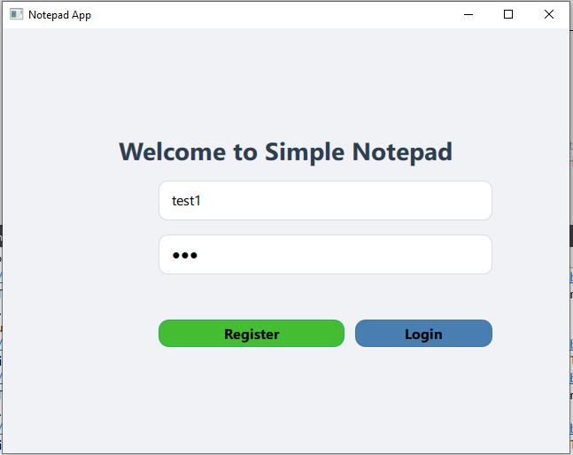
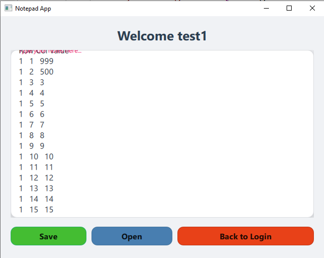

# Simple Notepad App

A simple cross-platform **Notepad application** built with **Qt 6 (QML + C++)**.  
Users can **register**, **login**, and **create/edit/save text files**.  

---

## Features

- User authentication (Register / Login)
- Open and save `.txt` files
- Scrollable text editor
- Modern and clean UI
- Works on desktop platforms (Windows / Linux / macOS)

---

## Screenshots

  


---

## Getting Started

### Prerequisites

- Qt 6.x (Qt Quick + Qt Quick Controls 6)
- C++ compiler (MinGW / MSVC / Clang)
- Git (optional, for version control)

### Running the project

1. Clone the repository:

```bash
git clone https://github.com/hasa1368/Simple-Notepad-with-QT.git
cd notepad
Open the project in Qt Creator.

Build and run the project.

Register a new user or login with an existing account.

Start creating and editing notes.

Project Structure
bash
Copy code
notepad/
├── main.cpp
├── Main.qml
├── LoginPage.qml
├── NotepadPage.qml
├── FileManager.cpp/.h
├── DatabaseManager.cpp/.h
├── resources/  # optional images or icons
└── README.md
Notes
All user data is stored locally (e.g., SQLite or flat file, depending on implementation).

File operations support only plain text files .txt.

Author
Hamed Sadeghi Firouzja
GitHub:https://github.com/hasa1368

